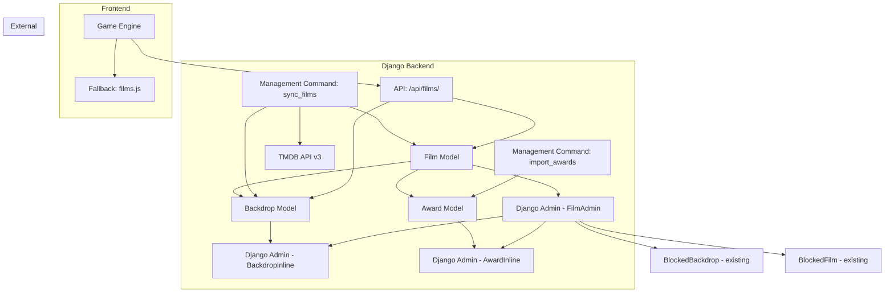
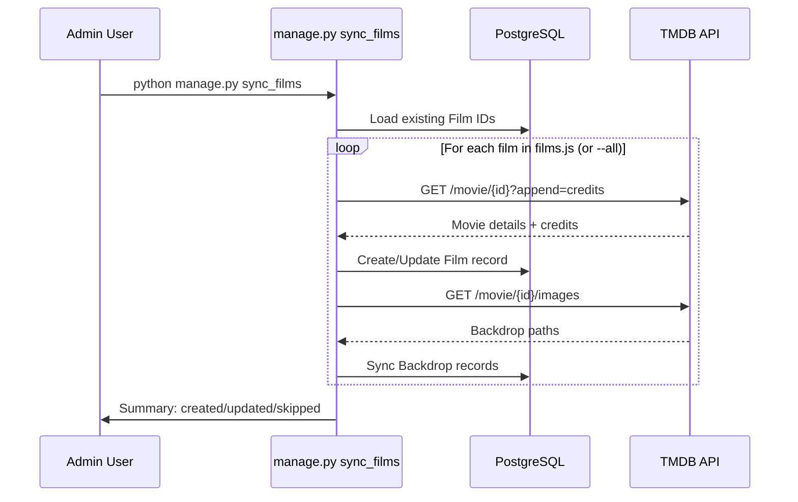
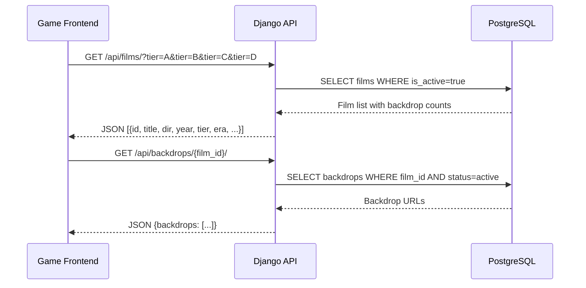
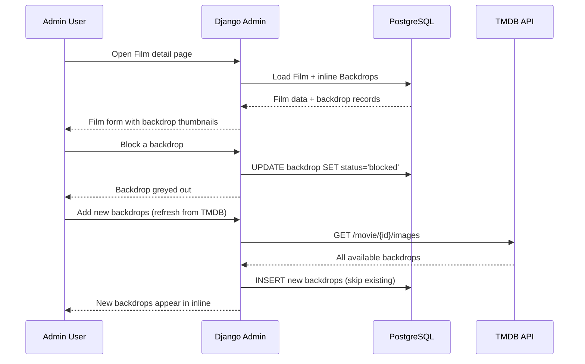

# Design Document: Film Admin Panel

## Overview

The Film Admin Panel migrates the game's film database from a static JavaScript array (`js/data/films.js`) into Django's PostgreSQL database, enriched with full TMDB metadata. This enables a rich Django admin interface for managing films and their backdrops (frames), with inline frame management, bulk actions, and a public API endpoint so the frontend reads films from the database instead of a hardcoded JS file.

The design preserves backward compatibility during migration — the frontend can fall back to the JS file while the DB is being populated. A management command handles TMDB import/sync, and the admin panel provides full CRUD for films and per-film backdrop management (block, delete, add).

## Architecture



## Sequence Diagrams

### Film Import from TMDB



### Frontend Film Loading



### Admin Frame Management



## Components and Interfaces

### Component 1: Film Model

**Purpose**: Stores all film metadata from TMDB, replacing the JS array as the source of truth.

```python
class Film(models.Model):
    TIER_CHOICES = [
        ('A', 'A — Niche Arthouse'),
        ('B', 'B — Ambitious / Festival'),
        ('C', 'C — Popular Quality'),
        ('D', 'D — Mainstream Classics'),
    ]

    CINEMA_ERA_CHOICES = [
        ('silent', 'Silent Era (< 1929)'),
        ('golden', 'Golden Age (1930–1959)'),
        ('new_wave', 'New Wave (1960–1979)'),
        ('modern', 'Modern (1980–1999)'),
        ('contemporary', 'Contemporary (2000+)'),
    ]

    # Core identifiers
    tmdb_id = models.IntegerField(unique=True, db_index=True)
    title = models.CharField(max_length=200)
    original_title = models.CharField(max_length=200, blank=True)

    # Metadata from TMDB
    director = models.CharField(max_length=120)
    year = models.PositiveSmallIntegerField()
    country = models.CharField(max_length=100, blank=True)  # primary production country
    genres = models.JSONField(default=list)  # ["Drama", "Thriller"]
    tmdb_rating = models.DecimalField(max_digits=3, decimal_places=1, null=True, blank=True)
    tmdb_vote_count = models.PositiveIntegerField(default=0)
    overview = models.TextField(blank=True)
    poster_path = models.CharField(max_length=120, blank=True)

    # Additional TMDB fields
    runtime = models.IntegerField(null=True, blank=True, help_text='Runtime in minutes')
    tagline = models.CharField(max_length=300, blank=True)
    imdb_id = models.CharField(max_length=20, blank=True, help_text='e.g. tt0111161')
    original_language = models.CharField(max_length=10, blank=True)
    production_companies = models.JSONField(default=list, blank=True, help_text='List of company names')
    belongs_to_collection = models.CharField(max_length=200, blank=True, help_text='e.g. "Star Wars Collection"')
    spoken_languages = models.JSONField(default=list, blank=True, help_text='List of language names')
    cast_top5 = models.JSONField(default=list, blank=True, help_text='Top 5 actors from credits')
    cinematographer = models.CharField(max_length=120, blank=True, help_text='Director of Photography')
    composer = models.CharField(max_length=120, blank=True, help_text='Original Music Composer')
    keywords = models.JSONField(default=list, blank=True, help_text='From /movie/{id}/keywords')
    budget = models.BigIntegerField(null=True, blank=True)
    revenue = models.BigIntegerField(null=True, blank=True)

    # Game-specific
    tier = models.CharField(max_length=1, choices=TIER_CHOICES, db_index=True)
    cinema_era = models.CharField(max_length=12, choices=CINEMA_ERA_CHOICES, blank=True,
                                  help_text='Auto-calculated from year, but manually overridable')
    is_active = models.BooleanField(default=True, db_index=True)

    # Sync tracking
    tmdb_last_synced = models.DateTimeField(null=True, blank=True)
    created = models.DateTimeField(auto_now_add=True)
    updated = models.DateTimeField(auto_now=True)

    class Meta:
        ordering = ['title']
        verbose_name = 'Film'
        verbose_name_plural = 'Filmy'
        indexes = [
            models.Index(fields=['tier', 'is_active']),
            models.Index(fields=['year']),
            models.Index(fields=['cinema_era']),
        ]

    def __str__(self):
        return f'{self.title} ({self.year}) — {self.director}'

    def save(self, *args, **kwargs):
        # Auto-calculate cinema_era from year if not manually set
        if not self.cinema_era and self.year:
            self.cinema_era = self._compute_era()
        super().save(*args, **kwargs)

    def _compute_era(self):
        if self.year < 1929:
            return 'silent'
        elif self.year <= 1959:
            return 'golden'
        elif self.year <= 1979:
            return 'new_wave'
        elif self.year <= 1999:
            return 'modern'
        else:
            return 'contemporary'

    @property
    def active_backdrop_count(self):
        return self.backdrops.filter(status='active').count()

    @property
    def poster_url(self):
        if self.poster_path:
            return f'{settings.TMDB_IMG_BASE}/w185{self.poster_path}'
        return ''

    @property
    def imdb_url(self):
        if self.imdb_id:
            return f'https://www.imdb.com/title/{self.imdb_id}/'
        return ''
```

**Responsibilities**:
- Store all TMDB metadata for each film (core + extended fields)
- Track game-specific fields (tier, cinema_era, is_active)
- Auto-calculate `cinema_era` from year on save (overridable by admin)
- Provide computed properties for admin display
- Replace the JS-based film array as source of truth

### Component 2: Backdrop Model

**Purpose**: Stores individual backdrop/frame images linked to films, with status management.

```python
class Backdrop(models.Model):
    STATUS_CHOICES = [
        ('active', 'Active'),
        ('blocked', 'Blocked'),
        ('deleted', 'Deleted'),
    ]

    film = models.ForeignKey(Film, on_delete=models.CASCADE, related_name='backdrops')
    file_path = models.CharField(max_length=120)  # TMDB path, e.g. /abc123.jpg
    status = models.CharField(max_length=10, choices=STATUS_CHOICES, default='active', db_index=True)
    width = models.PositiveIntegerField(default=0)
    height = models.PositiveIntegerField(default=0)
    language = models.CharField(max_length=10, blank=True)  # iso_639_1 from TMDB
    added = models.DateTimeField(auto_now_add=True)

    class Meta:
        unique_together = [('film', 'file_path')]
        ordering = ['-width']
        verbose_name = 'Kadr (backdrop)'
        verbose_name_plural = 'Kadry (backdrops)'

    def __str__(self):
        return f'{self.film.title} — {self.file_path}'

    @property
    def thumb_url(self):
        return f'{settings.TMDB_IMG_BASE}/w300{self.file_path}'

    @property
    def full_url(self):
        return f'{settings.TMDB_IMG_BASE}/w1280{self.file_path}'
```

**Responsibilities**:
- Link backdrops to their parent film
- Track status (active/blocked/deleted) per backdrop
- Store TMDB image metadata (dimensions, language)
- Provide URL helpers for admin thumbnails

### Component 3: Award Model

**Purpose**: Stores film awards/prizes as separate records linked to films, supporting inline editing and bulk import.

```python
class Award(models.Model):
    PRIZE_CHOICES = [
        ('oscars', 'Academy Awards (Oscars)'),
        ('golden_globes', 'Golden Globes'),
        ('cannes', 'Cannes Film Festival'),
        ('bafta', 'BAFTA'),
        ('efa', 'European Film Awards'),
        ('venice', 'Venice Film Festival'),
        ('berlinale', 'Berlin International Film Festival (Berlinale)'),
        ('sundance', 'Sundance Film Festival'),
    ]

    film = models.ForeignKey(Film, on_delete=models.CASCADE, related_name='awards')
    prize = models.CharField(max_length=20, choices=PRIZE_CHOICES)
    category = models.CharField(max_length=200, help_text='e.g. "Best Picture", "Palme d\'Or", "Best Director"')
    year = models.IntegerField(help_text='Year the award was given')
    person = models.CharField(max_length=200, blank=True, help_text='Who received it (actor/director name)')

    class Meta:
        ordering = ['-year', 'prize']
        verbose_name = 'Award'
        verbose_name_plural = 'Awards'
        indexes = [
            models.Index(fields=['prize', 'year']),
        ]

    def __str__(self):
        person_str = f' — {self.person}' if self.person else ''
        return f'{self.get_prize_display()} {self.year}: {self.category}{person_str}'
```

**Responsibilities**:
- Store award/prize information linked to a film
- Flexible `category` field (not constrained by choices) to support many different award categories
- Optional `person` field for actor/director-specific awards
- Manageable via inline in Film admin and via bulk import command
- Support querying films by awards (e.g. "all Oscar winners")

### Component 4: Django Admin Configuration

**Purpose**: Rich admin interface for managing films, backdrops, and awards.

```python
class AwardInline(admin.TabularInline):
    model = Award
    extra = 1
    fields = ('prize', 'category', 'year', 'person')


class BackdropInline(admin.TabularInline):
    model = Backdrop
    extra = 0
    readonly_fields = ('thumbnail', 'file_path', 'width', 'height', 'language', 'added')
    fields = ('thumbnail', 'file_path', 'status', 'width', 'language', 'added')

    def thumbnail(self, obj):
        if obj.file_path:
            return format_html(
                '',
                obj.thumb_url
            )
        return '-'
    thumbnail.short_description = 'Podgląd'


@admin.register(Film)
class FilmAdmin(admin.ModelAdmin):
    list_display = ('poster_thumb', 'title', 'director', 'year', 'tier_badge',
                    'cinema_era', 'tmdb_rating', 'award_count', 'backdrop_count', 'is_active')
    list_filter = ('tier', 'cinema_era', 'is_active', 'year', 'country')
    search_fields = ('title', 'original_title', 'director', 'tmdb_id', 'imdb_id')
    list_editable = ('is_active', 'tier', 'cinema_era')
    list_per_page = 50
    inlines = [AwardInline, BackdropInline]
    readonly_fields = ('tmdb_id', 'tmdb_last_synced', 'created', 'updated',
                       'poster_preview', 'tmdb_link', 'imdb_link')
    actions = ['sync_from_tmdb', 'activate_films', 'deactivate_films',
               'refresh_backdrops', 'recalculate_eras']

    fieldsets = (
        ('Film', {
            'fields': ('title', 'original_title', 'director', 'year', 'country', 'cinema_era')
        }),
        ('TMDB Core', {
            'fields': ('tmdb_id', 'tmdb_rating', 'tmdb_vote_count', 'overview',
                       'poster_path', 'poster_preview', 'tmdb_link', 'imdb_id',
                       'imdb_link', 'tmdb_last_synced')
        }),
        ('TMDB Extended', {
            'fields': ('runtime', 'tagline', 'original_language', 'belongs_to_collection',
                       'production_companies', 'spoken_languages', 'cast_top5',
                       'cinematographer', 'composer', 'keywords', 'budget', 'revenue'),
            'classes': ('collapse',)
        }),
        ('Game', {
            'fields': ('tier', 'genres', 'is_active')
        }),
        ('Timestamps', {
            'fields': ('created', 'updated'),
            'classes': ('collapse',)
        }),
    )

    def award_count(self, obj):
        return obj.awards.count()
    award_count.short_description = 'Awards'


@admin.register(Award)
class AwardAdmin(admin.ModelAdmin):
    """Standalone Award admin for bulk management and import."""
    list_display = ('film', 'prize', 'category', 'year', 'person')
    list_filter = ('prize', 'year')
    search_fields = ('film__title', 'category', 'person')
    autocomplete_fields = ('film',)
    list_per_page = 100
```

**Responsibilities**:
- Display films with poster thumbnails in list view
- Inline award management (add/edit awards per film)
- Inline backdrop management with visual thumbnails
- Standalone Award admin for bulk viewing/management
- Bulk actions: sync from TMDB, activate/deactivate, refresh backdrops, recalculate eras
- Filters by tier, cinema_era, year, country, active status
- Custom admin actions for batch operations

### Component 5: Management Command (sync_films)

**Purpose**: Import films from JS file and/or sync metadata from TMDB API, including all extended fields.

```python
# game/management/commands/sync_films.py

class Command(BaseCommand):
    help = 'Import/sync films from TMDB. Sources: JS file or TMDB API.'

    def add_arguments(self, parser):
        parser.add_argument('--source', choices=['js', 'tmdb'], default='js',
                            help='Import from JS file or refresh from TMDB API')
        parser.add_argument('--film-id', type=int, nargs='*',
                            help='Specific TMDB film IDs to sync')
        parser.add_argument('--all', action='store_true',
                            help='Sync all films in DB from TMDB')
        parser.add_argument('--backdrops', action='store_true',
                            help='Also sync backdrops for each film')
        parser.add_argument('--keywords', action='store_true',
                            help='Also fetch keywords for each film')
        parser.add_argument('--dry-run', action='store_true',
                            help='Show what would be done without saving')

    def handle(self, *args, **options):
        ...
```

### Component 6: Management Command (import_awards)

**Purpose**: Bulk import awards from a CSV/JSON file into the Award model.

```python
# game/management/commands/import_awards.py

class Command(BaseCommand):
    help = 'Bulk import awards from CSV or JSON file.'

    def add_arguments(self, parser):
        parser.add_argument('file', type=str, help='Path to CSV or JSON file')
        parser.add_argument('--format', choices=['csv', 'json'], default='csv',
                            help='File format (default: csv)')
        parser.add_argument('--dry-run', action='store_true',
                            help='Show what would be imported without saving')

    def handle(self, *args, **options):
        """
        Expected CSV columns: tmdb_id, prize, category, year, person
        Expected JSON: [{tmdb_id, prize, category, year, person}, ...]
        
        Matches films by tmdb_id, skips awards that already exist (same film+prize+category+year).
        """
        ...
```

**Responsibilities**:
- Parse existing `films.js` to seed the Film table
- Fetch full metadata from TMDB API (details, credits, images, keywords)
- Extract extended fields: runtime, tagline, imdb_id, original_language, production_companies, belongs_to_collection, spoken_languages, cast_top5, cinematographer, composer, keywords, budget, revenue
- Auto-calculate `cinema_era` from year for new films
- Bulk import awards from CSV/JSON
- Create/update Film and Backdrop records
- Handle rate limiting and API errors gracefully
- Support incremental and full sync modes

### Component 7: Public Films API

**Purpose**: Serve the film database to the game frontend, replacing the static JS import.

```python
# GET /api/films/
def api_films(request):
    """Return all active films for the game frontend."""
    films = Film.objects.filter(is_active=True).values(
        'tmdb_id', 'title', 'director', 'year', 'tier', 'cinema_era'
    )
    data = [
        {
            'id': f['tmdb_id'],
            'title': f['title'],
            'dir': f['director'],
            'y': f['year'],
            't': f['tier'],
            'era': f['cinema_era'],
        }
        for f in films
    ]
    return JsonResponse({'films': data})
```

**Responsibilities**:
- Serve active films in the same format the frontend currently expects
- Include new `era` field for frontend filtering
- Support optional filtering by tier and/or cinema_era
- Cache-friendly response (films change infrequently)
- Backward-compatible JSON shape (tier now A/B/C/D instead of c/a/r)

## Data Models

### Film (full schema)

| Field | Type | Constraints | Source |
|-------|------|-------------|--------|
| id | BigAutoField | PK | Django |
| tmdb_id | IntegerField | unique, indexed | TMDB |
| title | CharField(200) | required | TMDB |
| original_title | CharField(200) | optional | TMDB |
| director | CharField(120) | required | TMDB credits |
| year | PositiveSmallIntegerField | required | TMDB release_date |
| country | CharField(100) | optional | TMDB production_countries[0] |
| genres | JSONField | default=[] | TMDB genres |
| tmdb_rating | Decimal(3,1) | nullable | TMDB vote_average |
| tmdb_vote_count | PositiveIntegerField | default=0 | TMDB vote_count |
| overview | TextField | optional | TMDB |
| poster_path | CharField(120) | optional | TMDB |
| runtime | IntegerField | nullable | TMDB runtime |
| tagline | CharField(300) | optional | TMDB tagline |
| imdb_id | CharField(20) | optional | TMDB imdb_id |
| original_language | CharField(10) | optional | TMDB original_language |
| production_companies | JSONField | default=[] | TMDB production_companies[].name |
| belongs_to_collection | CharField(200) | optional | TMDB belongs_to_collection.name |
| spoken_languages | JSONField | default=[] | TMDB spoken_languages[].english_name |
| cast_top5 | JSONField | default=[] | TMDB credits.cast[:5].name |
| cinematographer | CharField(120) | optional | TMDB credits.crew (job="Director of Photography") |
| composer | CharField(120) | optional | TMDB credits.crew (job="Original Music Composer") |
| keywords | JSONField | default=[] | TMDB /movie/{id}/keywords |
| budget | BigIntegerField | nullable | TMDB budget |
| revenue | BigIntegerField | nullable | TMDB revenue |
| tier | CharField(1) | choices: A/B/C/D, indexed | Game config |
| cinema_era | CharField(12) | choices: silent/golden/new_wave/modern/contemporary | Auto from year or manual |
| is_active | BooleanField | default=True, indexed | Admin |
| tmdb_last_synced | DateTimeField | nullable | Sync command |
| created | DateTimeField | auto_now_add | Django |
| updated | DateTimeField | auto_now | Django |

**Validation Rules**:
- `tmdb_id` must be a positive integer and unique across all films
- `year` must be between 1888 (first film ever) and current year + 2
- `tier` must be one of: 'A' (niche arthouse), 'B' (ambitious/festival), 'C' (popular quality), 'D' (mainstream classics)
- `cinema_era` must be one of: 'silent', 'golden', 'new_wave', 'modern', 'contemporary'
- `cinema_era` auto-calculated from year on save if not explicitly set
- `title` and `director` are required (non-blank)
- `budget` and `revenue` are nullable (many films don't report these)

### Award (full schema)

| Field | Type | Constraints | Source |
|-------|------|-------------|--------|
| id | BigAutoField | PK | Django |
| film | ForeignKey(Film) | CASCADE, related_name='awards' | FK |
| prize | CharField(20) | choices: oscars/golden_globes/cannes/bafta/efa/venice/berlinale/sundance | Manual/Import |
| category | CharField(200) | required | Manual/Import |
| year | IntegerField | required | Manual/Import |
| person | CharField(200) | optional | Manual/Import |

**Validation Rules**:
- `film` must reference an existing Film
- `prize` must be one of the defined choices
- `category` is free-form text (flexible for different award types)
- `year` must be a valid year (1927+ for Oscars, reasonable range)
- `person` is optional (some awards like Best Picture don't go to a person)

### Backdrop (full schema)

| Field | Type | Constraints | Source |
|-------|------|-------------|--------|
| id | BigAutoField | PK | Django |
| film | ForeignKey(Film) | CASCADE, related_name='backdrops' | FK |
| file_path | CharField(120) | required | TMDB |
| status | CharField(10) | choices: active/blocked/deleted | Admin |
| width | PositiveIntegerField | default=0 | TMDB |
| height | PositiveIntegerField | default=0 | TMDB |
| language | CharField(10) | optional | TMDB iso_639_1 |
| added | DateTimeField | auto_now_add | Django |

**Validation Rules**:
- `(film, file_path)` must be unique together
- `file_path` must start with '/' (TMDB convention)
- `status` must be one of: 'active', 'blocked', 'deleted'

## Key Functions with Formal Specifications

### Function 1: sync_film_from_tmdb()

```python
def sync_film_from_tmdb(tmdb_id: int, tier: str = 'C') -> tuple[Film, bool]:
    """Fetch film metadata from TMDB and create/update local Film record.
    Fetches movie details + credits + keywords in one pass."""
    ...
```

**Preconditions:**
- `tmdb_id` is a positive integer corresponding to a valid TMDB movie
- `tier` is one of 'A', 'B', 'C', 'D'
- `settings.TMDB_API_KEY` is configured and valid

**Postconditions:**
- Returns `(film, created)` where `film` is a saved Film instance
- If film already existed: fields are updated, `created=False`
- If film is new: record is created, `created=True`
- `film.tmdb_last_synced` is set to current time
- All extended fields populated: runtime, tagline, imdb_id, original_language, production_companies, belongs_to_collection, spoken_languages, cast_top5, cinematographer, composer, keywords, budget, revenue
- `cinema_era` auto-calculated from year if not previously set
- No existing Backdrop or Award records are modified

### Function 2: sync_backdrops_for_film()

```python
def sync_backdrops_for_film(film: Film) -> dict:
    """Fetch backdrop images from TMDB and sync local Backdrop records."""
    ...
```

**Preconditions:**
- `film` is a saved Film instance with a valid `tmdb_id`
- `settings.TMDB_API_KEY` is configured

**Postconditions:**
- Returns `{'added': int, 'existing': int, 'total': int}`
- New backdrops from TMDB are created with status='active'
- Existing backdrops (by file_path) are not modified (preserves admin blocks)
- Backdrops in DB but no longer on TMDB are NOT deleted (preserves history)

### Function 3: parse_films_js()

```python
def parse_films_js(js_path: Path) -> list[dict]:
    """Parse the existing films.js file into structured data."""
    ...
```

**Preconditions:**
- `js_path` points to a readable file
- File contains a JavaScript array with objects having `id`, `title`, `dir`, `y`, `t` fields

**Postconditions:**
- Returns list of dicts, each with keys: `tmdb_id`, `title`, `director`, `year`, `tier`
- No side effects (pure parsing function)
- Raises `ValueError` if file format is unexpected

### Function 4: api_films()

```python
def api_films(request) -> JsonResponse:
    """Public API endpoint returning active films for the game."""
    ...
```

**Preconditions:**
- No authentication required (public endpoint)
- Database is accessible

**Postconditions:**
- Returns JSON `{"films": [...]}` with HTTP 200
- Each film object has keys: `id`, `title`, `dir`, `y`, `t`, `era`
- Only films with `is_active=True` are included
- `t` values are one of 'A', 'B', 'C', 'D'
- `era` values are one of 'silent', 'golden', 'new_wave', 'modern', 'contemporary'

### Function 5: import_awards_from_file()

```python
def import_awards_from_file(file_path: Path, format: str = 'csv', dry_run: bool = False) -> dict:
    """Bulk import awards from a CSV or JSON file."""
    ...
```

**Preconditions:**
- `file_path` points to a readable file
- `format` is 'csv' or 'json'
- CSV columns: tmdb_id, prize, category, year, person
- JSON: list of objects with same keys
- Referenced films (by tmdb_id) must exist in the database

**Postconditions:**
- Returns `{'created': int, 'skipped': int, 'errors': list}`
- Awards are matched by (film + prize + category + year) — duplicates skipped
- If `dry_run=True`, no records are created
- Invalid prize values or missing films logged as errors

## Algorithmic Pseudocode

### Import from JS File

```pascal
ALGORITHM import_from_js(js_path)
INPUT: js_path — path to films.js file
OUTPUT: summary dict {created, updated, skipped}

BEGIN
  films_data ← parse_films_js(js_path)
  created ← 0
  updated ← 0

  FOR each entry IN films_data DO
    existing ← Film.objects.filter(tmdb_id=entry.tmdb_id).first()

    IF existing IS NULL THEN
      Film.objects.create(
        tmdb_id=entry.tmdb_id,
        title=entry.title,
        director=entry.director,
        year=entry.year,
        tier=map_old_tier_to_new(entry.tier),  // c→D, a→B, r→A
        is_active=TRUE
        // cinema_era auto-calculated on save
      )
      created ← created + 1
    ELSE
      // Only update tier from JS, don't overwrite TMDB-enriched fields
      new_tier ← map_old_tier_to_new(entry.tier)
      IF existing.tier ≠ new_tier THEN
        existing.tier ← new_tier
        existing.save()
        updated ← updated + 1
      END IF
    END IF
  END FOR

  RETURN {created, updated, skipped: len(films_data) - created - updated}
END
```

**Tier Mapping (old → new)**:
- `'c'` (Classic) → `'D'` (Mainstream Classics)
- `'a'` (Ambitious) → `'B'` (Ambitious / Festival)
- `'r'` (Arthouse) → `'A'` (Niche Arthouse)

### Full TMDB Sync

```pascal
ALGORITHM sync_from_tmdb(film_ids, include_backdrops)
INPUT: film_ids — list of TMDB IDs (or all from DB), include_backdrops — boolean
OUTPUT: summary dict {synced, errors, backdrops_added}

BEGIN
  IF film_ids IS EMPTY THEN
    film_ids ← Film.objects.values_list('tmdb_id', flat=True)
  END IF

  synced ← 0
  errors ← []
  backdrops_added ← 0

  FOR each tmdb_id IN film_ids DO
    TRY
      // Fetch movie details with credits appended
      data ← tmdb_get(f'/movie/{tmdb_id}', append='credits')

      // Extract director from crew
      director ← first(c.name FOR c IN data.credits.crew WHERE c.job = 'Director')

      // Extract primary country
      country ← data.production_countries[0].name IF data.production_countries ELSE ''

      // Extract cinematographer from crew
      cinematographer ← first(c.name FOR c IN data.credits.crew WHERE c.job = 'Director of Photography')

      // Extract composer from crew
      composer ← first(c.name FOR c IN data.credits.crew WHERE c.job = 'Original Music Composer')

      // Extract top 5 cast
      cast_top5 ← [c.name FOR c IN data.credits.cast[:5]]

      // Extract production companies
      production_companies ← [c.name FOR c IN data.production_companies]

      // Extract spoken languages
      spoken_languages ← [l.english_name FOR l IN data.spoken_languages]

      // Extract collection name
      collection ← data.belongs_to_collection.name IF data.belongs_to_collection ELSE ''

      // Fetch keywords separately
      kw_data ← tmdb_get(f'/movie/{tmdb_id}/keywords')
      keywords ← [k.name FOR k IN kw_data.keywords]

      // Update or create Film
      film, _ ← Film.objects.update_or_create(
        tmdb_id=tmdb_id,
        defaults={
          title: data.title,
          original_title: data.original_title,
          director: director,
          year: int(data.release_date[:4]),
          country: country,
          genres: [g.name FOR g IN data.genres],
          tmdb_rating: data.vote_average,
          tmdb_vote_count: data.vote_count,
          overview: data.overview,
          poster_path: data.poster_path,
          runtime: data.runtime,
          tagline: data.tagline,
          imdb_id: data.imdb_id OR '',
          original_language: data.original_language,
          production_companies: production_companies,
          belongs_to_collection: collection,
          spoken_languages: spoken_languages,
          cast_top5: cast_top5,
          cinematographer: cinematographer OR '',
          composer: composer OR '',
          keywords: keywords,
          budget: data.budget IF data.budget > 0 ELSE NULL,
          revenue: data.revenue IF data.revenue > 0 ELSE NULL,
          tmdb_last_synced: now()
        }
      )
      synced ← synced + 1

      IF include_backdrops THEN
        result ← sync_backdrops_for_film(film)
        backdrops_added ← backdrops_added + result.added
      END IF

      sleep(0.25)  // Rate limiting

    CATCH RequestException AS e
      errors.append({tmdb_id, error: str(e)})
    END TRY
  END FOR

  RETURN {synced, errors, backdrops_added}
END
```

### Backdrop Sync per Film

```pascal
ALGORITHM sync_backdrops_for_film(film)
INPUT: film — Film instance with valid tmdb_id
OUTPUT: {added, existing, total}

BEGIN
  data ← tmdb_get(f'/movie/{film.tmdb_id}/images')
  tmdb_backdrops ← data.backdrops[:20]  // Cap at 20 per film

  existing_paths ← SET(film.backdrops.values_list('file_path', flat=True))
  added ← 0

  FOR each backdrop IN tmdb_backdrops DO
    IF backdrop.file_path NOT IN existing_paths THEN
      Backdrop.objects.create(
        film=film,
        file_path=backdrop.file_path,
        width=backdrop.width,
        height=backdrop.height,
        language=backdrop.iso_639_1 OR '',
        status='active'
      )
      added ← added + 1
    END IF
  END FOR

  RETURN {added, existing: len(existing_paths), total: len(tmdb_backdrops)}
END
```

### Bulk Award Import

```pascal
ALGORITHM import_awards_from_file(file_path, format, dry_run)
INPUT: file_path — path to CSV or JSON file, format — 'csv' or 'json', dry_run — boolean
OUTPUT: {created, skipped, errors}

BEGIN
  entries ← parse_file(file_path, format)
  // CSV columns or JSON keys: tmdb_id, prize, category, year, person

  created ← 0
  skipped ← 0
  errors ← []

  FOR each entry IN entries DO
    // Validate prize value
    IF entry.prize NOT IN VALID_PRIZE_KEYS THEN
      errors.append({entry, reason: 'Invalid prize value'})
      CONTINUE
    END IF

    // Find film by tmdb_id
    film ← Film.objects.filter(tmdb_id=entry.tmdb_id).first()
    IF film IS NULL THEN
      errors.append({entry, reason: 'Film not found'})
      CONTINUE
    END IF

    // Check for duplicate (same film + prize + category + year)
    existing ← Award.objects.filter(
      film=film, prize=entry.prize, category=entry.category, year=entry.year
    ).exists()

    IF existing THEN
      skipped ← skipped + 1
      CONTINUE
    END IF

    IF NOT dry_run THEN
      Award.objects.create(
        film=film,
        prize=entry.prize,
        category=entry.category,
        year=entry.year,
        person=entry.person OR ''
      )
    END IF
    created ← created + 1
  END FOR

  RETURN {created, skipped, errors}
END
```

## Example Usage

```python
# --- Management command usage ---

# Initial import from JS file (seeds the DB with 184 films)
# python manage.py sync_films --source js --backdrops

# Sync all films from TMDB (enriches metadata + extended fields + keywords)
# python manage.py sync_films --source tmdb --all --backdrops --keywords

# Sync specific films
# python manage.py sync_films --source tmdb --film-id 278 238 680

# Dry run to preview
# python manage.py sync_films --source tmdb --all --dry-run

# Bulk import awards from CSV
# python manage.py import_awards awards.csv
# CSV format: tmdb_id,prize,category,year,person
# Example row: 278,oscars,Best Picture,1995,

# Bulk import awards from JSON
# python manage.py import_awards awards.json --format json


# --- API usage (frontend) ---

# Frontend fetches films from API instead of importing JS:
# fetch('/api/films/')
#   .then(r => r.json())
#   .then(data => { FILMS = data.films; })

# Response shape (updated with 4-tier + era):
# {"films": [
#   {"id": 278, "title": "The Shawshank Redemption", "dir": "Frank Darabont", "y": 1994, "t": "D", "era": "modern"},
#   {"id": 431, "title": "Au hasard Balthazar", "dir": "Robert Bresson", "y": 1966, "t": "A", "era": "new_wave"},
#   ...
# ]}


# --- Admin actions (in Django admin) ---

# Bulk sync selected films from TMDB:
@admin.action(description='🔄 Sync selected films from TMDB')
def sync_from_tmdb(modeladmin, request, queryset):
    for film in queryset:
        sync_film_from_tmdb(film.tmdb_id, film.tier)
    modeladmin.message_user(request, f'Synced {queryset.count()} films.')

# Refresh backdrops for selected films:
@admin.action(description='🎞️ Refresh backdrops from TMDB')
def refresh_backdrops(modeladmin, request, queryset):
    total = 0
    for film in queryset:
        result = sync_backdrops_for_film(film)
        total += result['added']
    modeladmin.message_user(request, f'Added {total} new backdrops.')

# Recalculate cinema eras for selected films:
@admin.action(description='🕰️ Recalculate cinema eras from year')
def recalculate_eras(modeladmin, request, queryset):
    for film in queryset:
        film.cinema_era = film._compute_era()
        film.save(update_fields=['cinema_era'])
    modeladmin.message_user(request, f'Recalculated eras for {queryset.count()} films.')
```

## Correctness Properties

1. **Film uniqueness**: `∀ f1, f2 ∈ Film: f1.tmdb_id = f2.tmdb_id ⟹ f1.id = f2.id` — no duplicate TMDB IDs
2. **Backdrop uniqueness**: `∀ b1, b2 ∈ Backdrop: (b1.film = b2.film ∧ b1.file_path = b2.file_path) ⟹ b1.id = b2.id`
3. **Sync idempotency**: Running `sync_films` twice with same input produces identical DB state
4. **Status preservation**: `sync_backdrops_for_film(f)` never modifies the `status` of existing Backdrop records
5. **API shape invariant**: `/api/films/` response always contains objects with exactly keys: `id`, `title`, `dir`, `y`, `t`, `era`
6. **Active filter**: `/api/films/` never returns films where `is_active=False`
7. **Cascade integrity**: Deleting a Film deletes all its Backdrop and Award records (CASCADE)
8. **Tier validity**: `∀ f ∈ Film: f.tier ∈ {'A', 'B', 'C', 'D'}`
9. **Era auto-calculation**: `∀ f ∈ Film: if f.cinema_era = '' on save ⟹ f.cinema_era = compute_era(f.year)`
10. **Era consistency**: `compute_era(y) = 'silent' iff y < 1929, 'golden' iff 1930 ≤ y ≤ 1959, 'new_wave' iff 1960 ≤ y ≤ 1979, 'modern' iff 1980 ≤ y ≤ 1999, 'contemporary' iff y ≥ 2000`
11. **Award referential integrity**: `∀ a ∈ Award: a.film ∈ Film` — every award references an existing film
12. **Award prize validity**: `∀ a ∈ Award: a.prize ∈ VALID_PRIZE_KEYS`
13. **Award import idempotency**: Importing the same awards file twice doesn't create duplicate Award records
14. **BlockedBackdrop migration**: Existing `BlockedBackdrop` records map to `Backdrop` records with `status='blocked'`
15. **TMDB sync completeness**: After sync, all extended fields (runtime, tagline, imdb_id, etc.) are populated from TMDB data where available

## Error Handling

### Error Scenario 1: TMDB API Unavailable

**Condition**: TMDB returns 5xx or connection timeout during sync
**Response**: Log the error, skip the film, continue with next
**Recovery**: Re-run sync command later; partial progress is preserved

### Error Scenario 2: Film Not Found on TMDB

**Condition**: TMDB returns 404 for a given film ID
**Response**: Log warning, skip film, do not delete local record
**Recovery**: Admin can manually deactivate the film

### Error Scenario 3: Rate Limiting (429)

**Condition**: TMDB returns HTTP 429
**Response**: Wait 2 seconds, retry once; if still 429, skip and continue
**Recovery**: Built-in backoff; re-run for remaining films

### Error Scenario 4: Duplicate Import Attempt

**Condition**: `sync_films --source js` run when films already exist
**Response**: Skip existing films (matched by tmdb_id), only create new ones
**Recovery**: Idempotent operation, safe to re-run

### Error Scenario 5: Frontend API Failure

**Condition**: `/api/films/` returns error or empty list
**Response**: Frontend falls back to static `films.js` import
**Recovery**: Automatic — frontend uses try/catch with fallback

## Testing Strategy

### Unit Testing Approach

- Test `parse_films_js()` with the actual `films.js` file (184 entries expected)
- Test Film/Backdrop/Award model validation (tier choices, year range, unique constraints, prize choices)
- Test `cinema_era` auto-calculation for boundary years (1928, 1929, 1930, 1959, 1960, 1979, 1980, 1999, 2000)
- Test `cinema_era` manual override (setting explicitly should not be recalculated on save)
- Test `api_films()` view returns correct shape and filters inactive films
- Test `import_awards_from_file()` with valid/invalid data, duplicates, missing films
- Test admin actions don't crash on empty querysets

### Property-Based Testing Approach

**Property Test Library**: hypothesis (Python)

- **Import idempotency**: For any valid film data, importing twice yields same DB count
- **API shape stability**: For any set of active films, API response always has required keys (including `era`)
- **Backdrop sync safety**: For any film, syncing backdrops never reduces active backdrop count
- **Era calculation determinism**: For any year, `_compute_era()` always returns a valid choice
- **Award import idempotency**: For any valid award CSV, importing twice yields same Award count

### Integration Testing Approach

- Test full sync flow with mocked TMDB responses (including extended fields extraction)
- Test migration path: JS import → TMDB enrichment → API serving
- Test admin inline backdrop and award display with test data
- Test award bulk import from CSV and JSON formats
- Test backward compatibility: existing `BlockedBackdrop`/`BlockedFilm` records still work

## Performance Considerations

- **DB indexing**: Composite index on `(tier, is_active)` for the main game query
- **API caching**: `/api/films/` response can be cached (films change only via admin)
- **Sync rate limiting**: 0.25s delay between TMDB requests, retry on 429
- **Backdrop cap**: Maximum 20 backdrops stored per film to control storage
- **Admin pagination**: 50 films per page, with search/filter to narrow results
- **Backdrop count annotation**: Use `Count` annotation in admin queryset to avoid N+1

## Security Considerations

- TMDB API key remains server-side only (already handled in settings)
- `/api/films/` is public (read-only, no sensitive data)
- Admin panel requires authentication (Django admin's built-in auth)
- Management command requires shell access (server-only)
- No user-submitted data in Film/Backdrop models (all from TMDB or admin)

## Dependencies

- **Django** (existing) — ORM, admin, management commands
- **requests** (existing) — TMDB API calls
- **PostgreSQL** (existing on Railway) — database backend
- **TMDB API v3** (existing integration) — film metadata and images
- No new third-party packages required

## Migration Path

### Phase 1: DB Setup
1. Create Film, Backdrop, and Award models, run migrations
2. Run `sync_films --source js --backdrops` to seed from existing 184 films
3. Run `sync_films --source tmdb --all --backdrops --keywords` to enrich with full TMDB metadata (including extended fields)
4. `cinema_era` auto-calculated on first save for all imported films

### Phase 2: Awards
5. Prepare awards CSV (research major prizes for films in the collection)
6. Run `import_awards awards.csv` to bulk-load award data
7. Verify via admin inline that awards display correctly

### Phase 3: Admin Panel
8. Register FilmAdmin with AwardInline and BackdropInline
9. Register standalone AwardAdmin for bulk award management
10. Migrate existing `BlockedBackdrop` records into Backdrop model (status='blocked')
11. Admin can now manage films, awards, and frames

### Phase 4: Frontend Migration
12. Add `/api/films/` endpoint (with new tier A/B/C/D and era field)
13. Update frontend to fetch from API with JS fallback
14. Update frontend tier filtering to use A/B/C/D system
15. Once stable, remove `films.js` dependency

### Phase 5: Cleanup
16. Deprecate `BlockedBackdrop` and `BlockedFilm` models (replaced by Backdrop.status and Film.is_active)
17. Remove in-memory TMDB_CACHE from views.py (backdrops now in DB)
